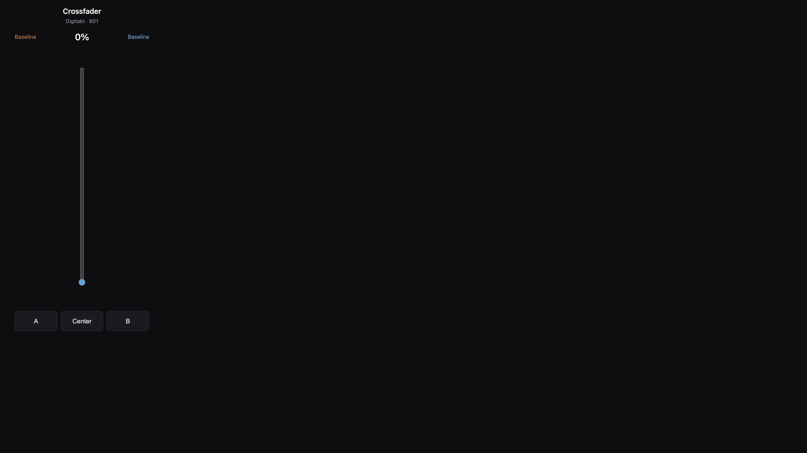

# Overbridge Scenes

Octatrack-style **scene snapshots** and an **A/B crossfader** for Elektron
Overbridge devices (Digitakt, Syntakt, Analog Heat, Analog Rytm, and others).
A lightweight local VST3 host drives the Overbridge plugin and serves web
control surfaces, so you can snapshot and morph parameters **without a DAW**.

| Surface | URL | Purpose |
|---------|-----|---------|
| **Scenes & crossfader** | [`/scenes.html`](http://127.0.0.1:7780/scenes.html) | Full scene editor + morph |
| **Remote crossfader** | [`/remote.html`](http://127.0.0.1:7780/remote.html) | Phone/tablet slider only |
| **Classic control** | [`/`](http://127.0.0.1:7780/) | Browse and tweak all parameters |

## Screenshots

### Scenes & crossfader

Pattern selection, A/B assignment, crossfader, clock slide, four scene slots,
and parameter picker.


### Remote crossfader (phone)

Crossfader-only page for Wi‑Fi devices on the same network. Uses the same
scene assignments and morph engine as the desktop UI.



### Classic parameter browser

Search, pin, and adjust any plugin parameter. Useful for exploration and
one-off tweaks.


## Features

- **4 scene snapshots per pattern** — each scene stores only the parameters you
  choose and the value each should take, like an Octatrack scene.
- **A/B crossfader** — assign a scene to each side and drag to morph every
  mapped parameter in real time. Snap buttons (`⟵ A`, `·`, `B ⟶`) too.
- **Per-pattern scenes on disk** — saved under `data/scenes/<plugin>/<pattern>.json`
  via the host API. Browser `localStorage` is used only as a fallback if the
  file is missing.
- **Pattern selection & Program Change follow** — pick bank A–P and pattern
  1–16 manually, or enable **Follow Program Change** to auto-switch when the
  device sends MIDI PC (Digitakt port in the header MIDI selector).
- **Pattern baseline** — capture a neutral “home” snapshot per pattern for empty
  crossfader sides. Until you capture one, an empty side follows the live value.
- **Param Learn** — click **Learn** on a scene card, wiggle a hardware control,
  and the changed parameter is added (or updated) in that scene.
- **Clock slide** — drive the crossfader from MIDI clock over N bars (default 8),
  synced to transport Start and bar 1. Uses the header MIDI input.
- **MIDI crossfader mapping** — map an absolute fader (0–127) or a relative
  encoder to the crossfader (host or Web MIDI).
- **Remote slider** — `/remote.html` exposes only the crossfader for phones and
  tablets on your LAN. Open `http://<your-mac>.local:7780/remote.html` (set the
  friendly name under **System Settings → General → Sharing → Local Hostname**)
  or use the IP logged at startup.
- **Live, bidirectional** — hardware knob moves stream into the UI; UI changes
  mirror to the device. Built-in **device monitoring** keeps the analog Main Out
  audible while the host is connected.
- **Debug MIDI log** — run with `--debug` or `OB_DEBUG=1` to show a per-message
  MIDI log in the scenes UI.
- **Full HTTP / WebSocket / MIDI API** — everything the UI does is available
  programmatically for your own tools.

## What this repo contains

This repository ships **source code only**. It does **not** include Elektron's
proprietary software:

| Component | In this repo? | How you get it |
|-----------|---------------|----------------|
| Overbridge Scenes host + web UI | Yes | Clone and build |
| [`truce-rack-vst3`](vendor/truce-rack-vst3/) (open-source VST3 host crate) | Yes | Vendored (MIT or Apache-2.0) |
| Elektron Overbridge VST3 plugins | **No** | Install [Overbridge](https://www.elektron.se/support-downloads/overbridge), then run `./scripts/copy-plugins.sh` |
| Overbridge Engine | **No** | Installed with Overbridge; `setup.sh` may copy a local reference into `vendor/` (gitignored) |

Local copies created by the setup scripts live in `plugins/` and
`vendor/Overbridge Engine.app`. Scene data is written to `data/scenes/` (also
gitignored). Both paths stay on your machine.

## Quick start

```bash
git clone https://github.com/MartinNeifert/overbridge-scenes.git
cd overbridge-scenes

# Copy VST3 plugins from your system install + build
./scripts/setup.sh

# Ensure the device is USB-connected in Overbridge mode
./scripts/start-engine.sh

# Launch the host (duplex audio + monitoring is the default)
RUST_LOG=info ./target/release/ob-host --plugin Digitakt

# Open the scenes control surface
open http://127.0.0.1:7780/scenes.html
```

On startup the host logs LAN URLs for the remote slider, for example:

```
LAN remote crossfader: http://192.168.1.42:7780/remote.html
LAN remote crossfader: http://digitakt.local:7780/remote.html
```

Optional flags:

```bash
# MIDI message log in the scenes UI
RUST_LOG=info ./target/release/ob-host --plugin Digitakt --debug
```

For other run modes, CLI flags, and the architecture overview, see
[`docs/architecture.md`](docs/architecture.md).

## Using scenes & the crossfader

### Build a scene

1. Pick the scene to edit under **Add parameters to**.
2. Search a parameter and click **＋** — it captures the current live value.
3. Or click **Learn** on a scene card and move a hardware control — the
   parameter that changes most is added automatically.
4. **Snapshot live** re-captures every parameter already in the scene from the
   device. Fine-tune a stored value with the row slider (edits the scene only,
   not the crossfader morph). Remove a parameter with **✕**.
5. **Recall** applies a whole scene instantly, independent of the crossfader.

### Morph

Assign **Scene A** (left) and **Scene B** (right), then drag the crossfader. The
union of parameters across the two scenes is interpolated:

- locked in both scenes → morphs A-value ↔ B-value;
- locked in only one scene → morphs that lock ↔ the baseline;
- one side set to `— None —` → morphs the other scene ↔ the baseline.

Use **Capture baseline** to set the neutral home for empty sides; otherwise an
empty side follows the live value.

Enable **Clock slide** to sweep the crossfader over N bars from MIDI clock
(press Play on the device). Set **Bars** to match your pattern length.

Scenes, baselines, and A/B assignments persist per plugin and per pattern under
`data/scenes/`. Full behaviour and rationale:
[`docs/designs/scenes-crossfader.md`](docs/designs/scenes-crossfader.md).

### Remote slider from your phone

1. Mac and phone on the same Wi‑Fi.
2. Start `ob-host` (it listens on all interfaces, port **7780** by default).
3. On the phone, open the LAN URL from the startup log, or
   `http://<Local Hostname>.local:7780/remote.html`.
4. The remote page follows the active pattern from the desktop scenes UI. Override
   with `?pattern=B05` if needed.

## Programmatic control

Everything the UI does is available over HTTP, WebSocket, and a virtual MIDI
port — poll/set parameters, send MIDI, drive a custom controller, or batch a
whole morph in one request. Scene files are exposed at
`GET/PUT /api/scenes/{plugin}/{pattern}`. See
[`docs/api-reference.md`](docs/api-reference.md).

```bash
curl http://127.0.0.1:7780/api/parameters | jq '.[0:5]'
curl http://127.0.0.1:7780/api/scenes/Digitakt/A01
```

## Documentation

| Doc | Purpose |
|-----|---------|
| [`docs/architecture.md`](docs/architecture.md) | Layered architecture, run modes, CLI flags, project layout, dev notes |
| [`docs/api-reference.md`](docs/api-reference.md) | HTTP / WebSocket / MIDI API, controller mapping, client examples |
| [`docs/designs/`](docs/designs/) | Design decisions — VST3 hosting, param/preset sync, audio + control API, [scenes & crossfader](docs/designs/scenes-crossfader.md) |
| [`docs/machines/`](docs/machines/) | Device-specific notes (e.g. [Analog Heat MKII](docs/machines/analog-heat-mk2.md)) |
| [`docs/active-issues/`](docs/active-issues/) | Open problems (e.g. [param-sync jitter](docs/active-issues/jitter-on-param-sync.md)) |

See [`docs/README.md`](docs/README.md) for the full index.

## Requirements

- macOS (Apple Silicon or Intel)
- [Elektron Overbridge](https://www.elektron.se/support-downloads/overbridge) installed (`/Applications/Elektron/`)
- Rust toolchain (`brew install rust` or rustup)
- Hardware in **Overbridge USB mode** (not MIDI-only)

## License

**Overbridge Scenes** (this repository) is licensed under the [MIT License](LICENSE).

**Third-party components included in this repo:**

- [`vendor/truce-rack-vst3`](vendor/truce-rack-vst3/) — MIT or Apache-2.0, at your option

**Not included — proprietary Elektron software you must install separately:**

- Elektron Overbridge VST3 plugins
- Overbridge Engine

Elektron is not affiliated with this project.
