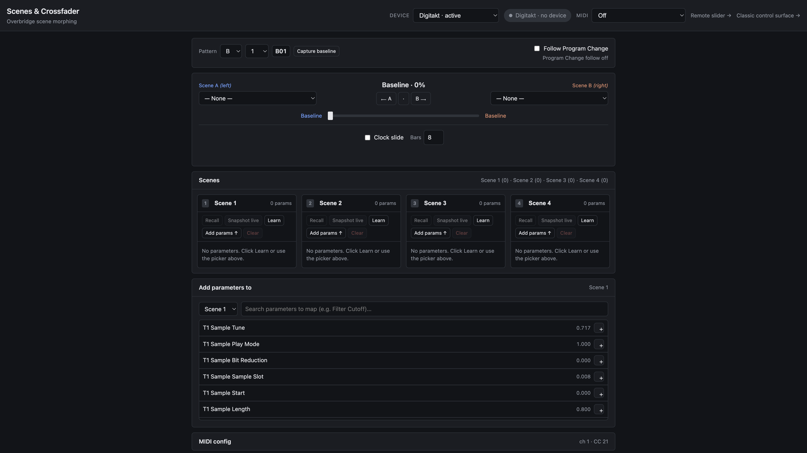
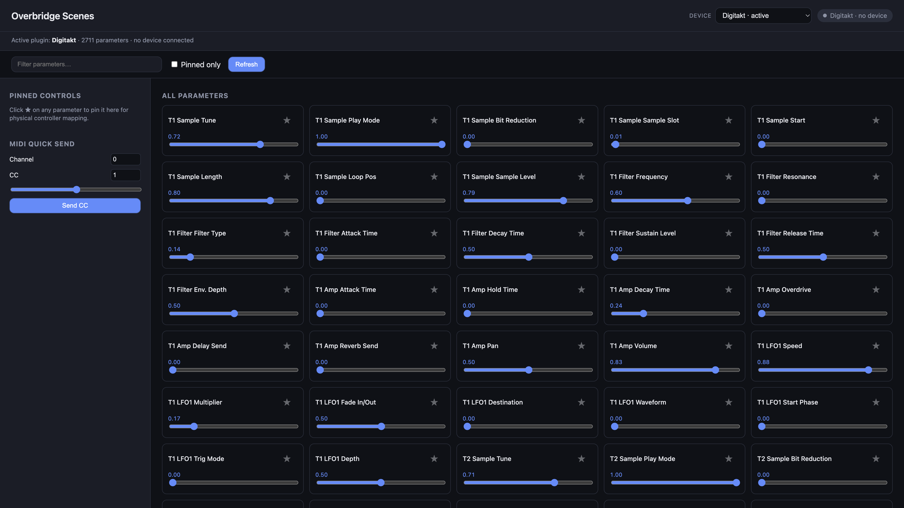

# Overbridge Scenes

> **Octatrack-style scenes. A/B crossfader. No DAW required.**

Snapshot a handful of parameters, assign them to four scenes per pattern, and
morph between them in real time — Digitakt, Syntakt, Analog Heat, Analog Rytm,
and the rest of the Overbridge family. A tiny local VST3 host drives the
plugin and serves the web UI from your Mac.

---

## Control surfaces

| Surface | Open it | What it's for |
|---------|---------|---------------|
| **Scenes & crossfader** | [`/scenes.html`](http://127.0.0.1:7780/scenes.html) | Build scenes, morph, MIDI clock slide |
| **Remote crossfader** | [`/remote.html`](http://127.0.0.1:7780/remote.html) | Crossfader only — great on a phone over Wi‑Fi |
| **Classic control** | [`/`](http://127.0.0.1:7780/) | Browse, search, and tweak all 2,700+ parameters |

---

## Screenshots

### Scenes & crossfader

Pattern bar, A/B assignment, crossfader, clock slide, four scene slots, and the
parameter picker — the main event.



### Classic parameter browser

Search, pin favourites, nudge anything. Handy when you don't know the exact
parameter name yet.



---

## What you get

### Scenes & morphing

- **4 scene snapshots per pattern** — each scene holds only the parameters you
  pick, at the values you want. Just like an Octatrack scene.
- **A/B crossfader** — assign a scene to each side and drag to morph every mapped
  parameter live. Snap buttons too: `⟵ A` · `B ⟶`.
- **Pattern baseline** — **Capture baseline** stores a neutral “home” per pattern
  for empty crossfader sides. No capture yet? Empty sides follow the live value.
- **Param Learn** — hit **Learn** on a scene card, wiggle a knob, and the
  parameter that moved gets added (or updated).

### Patterns & persistence

- **Per-pattern scenes on disk** — `data/scenes/<plugin>/<pattern>.json` via the
  host API. Browser `localStorage` is a fallback only.
- **Pattern selection & PC follow** — banks A–P, patterns 1–16, or enable
  **Follow Program Change** to switch when the Digitakt sends MIDI PC (pick the
  port in the header MIDI selector).

### MIDI & motion

- **Clock slide** — sweep the crossfader over N bars (default 8) from MIDI clock,
  locked to transport Start and bar 1. Uses the header MIDI input.
- **MIDI crossfader mapping** — absolute fader (0–127) or relative encoder, via
  host or Web MIDI.
- **Debug MIDI log** — `--debug` or `OB_DEBUG=1` for a per-message log in the
  scenes UI.

### Remote & live sync

- **Remote slider** — `/remote.html` is crossfader-only for phones and tablets on
  your LAN. Open `http://<your-mac>.local:7780/remote.html` (set **System
  Settings → General → Sharing → Local Hostname**) or use the IP from startup
  logs. Follows the active pattern from the desktop UI; override with
  `?pattern=B05`.
- **Live, bidirectional** — hardware moves show up in the UI; UI writes hit the
  device. Duplex monitoring keeps the analog Main Out audible while connected.

### For builders

- **Full HTTP / WebSocket / MIDI API** — poll, set, batch morph, send MIDI, roll
  your own controller. Scene files at `GET/PUT /api/scenes/{plugin}/{pattern}`.

---

## What's in the box (and what isn't)

This repo is **source code only** — no proprietary Elektron binaries.

| Component | Included? | How to get it |
|-----------|-----------|---------------|
| Overbridge Scenes host + web UI | ✓ | Clone & build |
| [`truce-rack-vst3`](vendor/truce-rack-vst3/) | ✓ | Vendored (MIT / Apache-2.0) |
| Elektron Overbridge VST3 plugins | ✗ | [Install Overbridge](https://www.elektron.se/support-downloads/overbridge) → `./scripts/copy-plugins.sh` |
| Overbridge Engine | ✗ | Ships with Overbridge; `setup.sh` may copy a local ref into `vendor/` (gitignored) |

`plugins/`, `vendor/Overbridge Engine.app`, and `data/scenes/` stay on your
machine — all gitignored.

---

## Audio routing (experimental)

> **Not performance-ready.** This is a control-plane prototype. Expect occasional
> clicks, dropouts, or rough edges on the audio path — especially while parameters
> are changing quickly, the crossfader is moving, or the plugin is syncing state.
> Do not rely on it for live shows, recording, or critical listening yet.

The web UI and API are the main product. Audio exists so the Overbridge plugin can
stay connected and push parameter/MIDI changes to the hardware — the same reason
a DAW keeps the plugin loaded, not because this is a finished audio driver.

### Signal path (high level)

```text
  Web UI / HTTP / WebSocket / MIDI
              │
              ▼
         ob-host (VST3 host)
              │
              ▼
    Elektron Overbridge VST3 plugin  ──►  Overbridge Engine  ──USB──►  device
              │
              ▼
    CoreAudio duplex on the Elektron device (default mode)
```

### Default: duplex + monitoring

Out of the box, `ob-host` opens the Elektron as a **single CoreAudio duplex**
device (one clock, one driver — similar to selecting it as input *and* output in
a DAW):

| Path | What it does |
|------|----------------|
| **Control** | The VST3 plugin + Engine carry parameter and MIDI changes to the box. |
| **What you hear** | While connected, the device's **Main Out plays the USB return**. We copy the device's own input (Main L/R by default) back to that output so you still hear the internal mix — DAW-style monitoring, not the VST's audio bus. |
| **Why `process()` runs** | Keeps the plugin alive and the Overbridge link happy; it is not a polished low-latency performance pipeline. |

Tunable in `config/default.json`: `duplex.device`, `duplex.monitor`,
`duplex.monitor_source`, `duplex.monitor_gain`.

### If you only want control (no host audio path)

```bash
RUST_LOG=info ./target/release/ob-host --plugin Digitakt --control-only
```

The host never opens the device audio stream. The hardware runs its own audio
untouched; you still get scenes, crossfader, and API control. Useful when glitches
on the monitor path are getting in the way.

### Known rough edges

- Real-time safety is best-effort: the audio callback uses `try_lock()` on the
  plugin; heavy param sync or editor work can still cause **lock-skips** and brief
  artifacts on the monitor path.
- Parameter sync and crossfader morphs share the same plugin — fast morphs can
  interact with [param-sync jitter](docs/active-issues/jitter-on-param-sync.md).
- Duplex monitoring has had [click/dropout issues](docs/active-issues/audio-artifacts-duplex-monitoring.md)
  that are largely mitigated but not “DAW-grade” yet.

More detail: [`docs/architecture.md`](docs/architecture.md) ·
[`docs/designs/audio-cutout-and-duplex-fix.md`](docs/designs/audio-cutout-and-duplex-fix.md) ·
[`docs/designs/audio-routing-and-control-options.md`](docs/designs/audio-routing-and-control-options.md)

---

## Quick start

```bash
git clone https://github.com/MartinNeifert/overbridge-scenes.git
cd overbridge-scenes

./scripts/setup.sh              # copy VST3s + build
./scripts/start-engine.sh       # Overbridge Engine (USB mode)
RUST_LOG=info ./target/release/ob-host --plugin Digitakt

open http://127.0.0.1:7780/scenes.html
```

Startup also prints LAN URLs for the remote slider:

```
LAN remote crossfader: http://192.168.1.42:7780/remote.html
LAN remote crossfader: http://digitakt.local:7780/remote.html
```

Want the MIDI tap? Add `--debug`:

```bash
RUST_LOG=info ./target/release/ob-host --plugin Digitakt --debug
```

More run modes and architecture: [`docs/architecture.md`](docs/architecture.md).

---

## How to use it

### Build a scene

1. Choose a scene under **Add parameters to**.
2. Search → **＋** to capture the current live value.
3. Or **Learn** on a scene card + move hardware — biggest wiggle wins.
4. **Snapshot live** refreshes every param already in the scene from the device.
   Row sliders edit the *scene* value only (not the crossfader morph). **✕**
   removes a param.
5. **Recall** slams the whole scene to the device, crossfader aside.

### Morph

Pick **Scene A** and **Scene B**, drag the fader. Every param in the union
morphs like this:

| Situation | What happens |
|-----------|--------------|
| Locked in both scenes | A-value ↔ B-value |
| Locked in one scene only | That lock ↔ baseline |
| Side is `— None —` | Other scene ↔ baseline |

**Capture baseline** for a fixed home on empty sides. **Clock slide** auto-sweeps
over N bars when you hit Play — set **Bars** to your pattern length.

Deep dive: [`docs/designs/scenes-crossfader.md`](docs/designs/scenes-crossfader.md).

---

## Programmatic control

Same powers as the UI — HTTP, WebSocket, virtual MIDI port:

```bash
curl http://127.0.0.1:7780/api/parameters | jq '.[0:5]'
curl http://127.0.0.1:7780/api/scenes/Digitakt/A01
```

Full reference: [`docs/api-reference.md`](docs/api-reference.md).

---

## Docs

| Doc | Why read it |
|-----|-------------|
| [`docs/architecture.md`](docs/architecture.md) | Layers, CLI, project layout |
| [`docs/api-reference.md`](docs/api-reference.md) | HTTP / WS / MIDI API |
| [`docs/designs/`](docs/designs/) | Design notes incl. [scenes & crossfader](docs/designs/scenes-crossfader.md) |
| [`docs/machines/`](docs/machines/) | Device quirks (e.g. [Analog Heat MKII](docs/machines/analog-heat-mk2.md)) |
| [`docs/active-issues/`](docs/active-issues/) | Known rough edges |

Index: [`docs/README.md`](docs/README.md).

---

## Requirements

- macOS (Apple Silicon or Intel)
- [Elektron Overbridge](https://www.elektron.se/support-downloads/overbridge) (`/Applications/Elektron/`)
- Rust (`brew install rust` or rustup)
- Hardware in **Overbridge USB mode** — not MIDI-only

---

## License

[MIT License](LICENSE). Not affiliated with Elektron.
