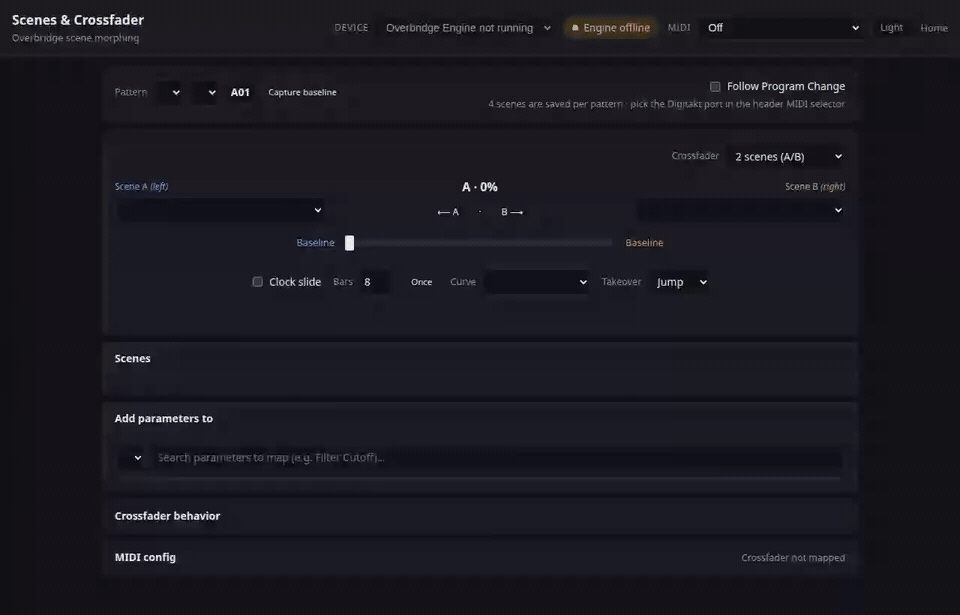
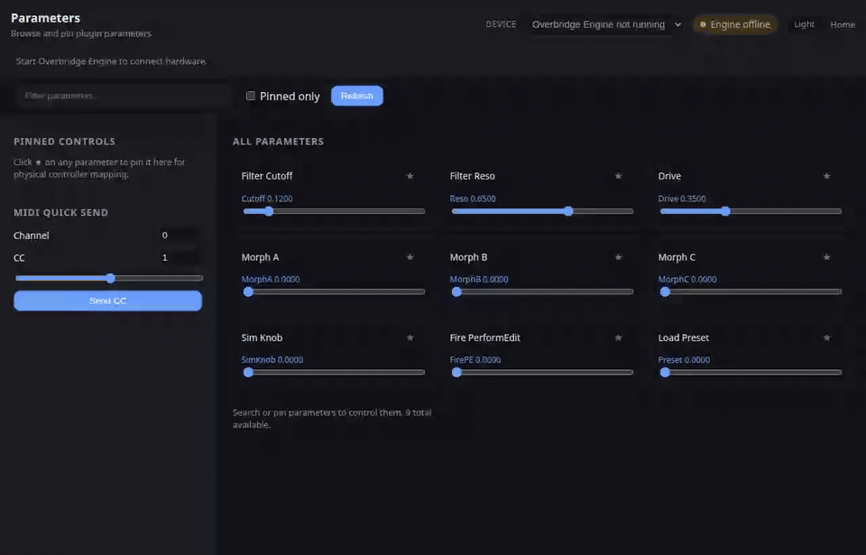
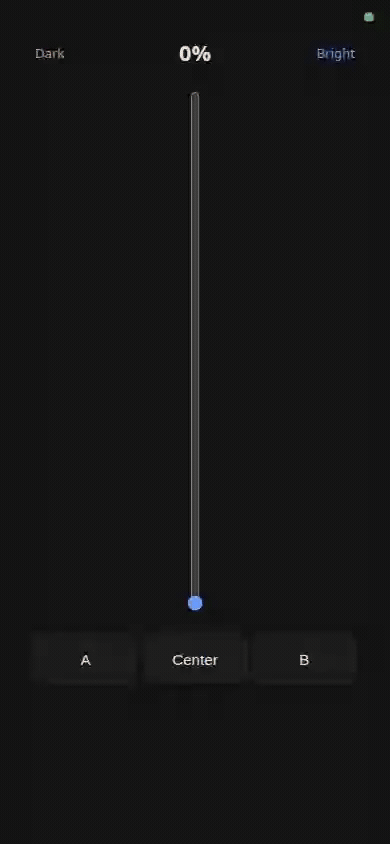

# Overbridge Scenes

> **Octatrack-style scenes. A/B crossfader. No DAW required.**

Snapshot a handful of parameters, assign them to four scenes per pattern, and
morph between them in real time — Digitakt, Syntakt, Analog Heat, Analog Rytm,
and the rest of the Overbridge family. A tiny local VST3 host drives the
plugin and serves the web UI from your Mac.

---

## Control surfaces

| Surface | Open it | What it's for |
|---------|---------|---------------|
| **Scenes & crossfader** | [`/scenes.html`](http://127.0.0.1:7780/scenes.html) | Build scenes, morph, MIDI clock slide |
| **Remote crossfader** | [`/remote.html`](http://127.0.0.1:7780/remote.html) | Crossfader only — great on a phone over Wi‑Fi |
| **Classic control** | [`/`](http://127.0.0.1:7780/) | Browse, search, and tweak all 2,700+ parameters |

---

## Screenshots & demos

### Scenes & crossfader

Pattern bar, A/B assignment, crossfader, clock slide, four scene slots, and the
parameter picker — the main event.



### Classic parameter browser

Search, pin favourites, nudge anything. Handy when you don't know the exact
parameter name yet.



### Remote crossfader

Crossfader-only surface for phones and tablets on your LAN — follows the active
pattern from the desktop UI.



To regenerate these clips locally (uses the in-process fake plugin — no hardware
required; writes MP4 + GIF under `docs/videos/`):

```bash
cargo build --release
OB_FAKE_PLUGIN=1 ./target/release/ob-host --fake-plugin --port 7780 &
npm install && node scripts/record-demo-videos.mjs
```

---

## What you get

### Scenes & morphing

- **4 scene snapshots per pattern** — each scene holds only the parameters you
  pick, at the values you want. Just like an Octatrack scene.
- **A/B crossfader** — assign a scene to each side and drag to morph every mapped
  parameter live. Snap buttons too: `⟵ A` · `B ⟶`.
- **Pattern baseline** — **Capture baseline** stores a neutral “home” per pattern
  for empty crossfader sides. No capture yet? Empty sides follow the live value.
- **Param Learn** — hit **Learn** on a scene card, wiggle a knob, and the
  parameter that moved gets added (or updated).

### Patterns & persistence

- **Per-pattern scenes on disk** — `data/scenes/<plugin>/<pattern>.json` via the
  host API. Browser `localStorage` is a fallback only.
- **Pattern selection & PC follow** — banks A–P, patterns 1–16, or enable
  **Follow Program Change** to switch when the Digitakt sends MIDI PC (pick the
  port in the header MIDI selector).

### MIDI & motion

- **Clock slide** — sweep the crossfader over N bars (default 8) from MIDI clock,
  locked to transport Start and bar 1. Uses the header MIDI input.
- **MIDI crossfader mapping** — absolute fader (0–127) or relative encoder, via
  host or Web MIDI.
- **Debug MIDI log** — `--debug` or `OB_DEBUG=1` for a per-message log in the
  scenes UI.

### Remote & live sync

- **Remote slider** — `/remote.html` is crossfader-only for phones and tablets on
  your LAN. Open `http://<your-mac>.local:7780/remote.html` (set **System
  Settings → General → Sharing → Local Hostname**) or use the IP from startup
  logs. Follows the active pattern from the desktop UI; override with
  `?pattern=B05`.
- **Live, bidirectional** — hardware moves show up in the UI; UI writes hit the
  device. Default control-only mode leaves device audio to the hardware (or your
  DAW) while the host handles parameters.

### For builders

- **Full HTTP / WebSocket / MIDI API** — poll, set, batch morph, send MIDI, roll
  your own controller. Scene files at `GET/PUT /api/scenes/{plugin}/{pattern}`.

---

## What's in the box (and what isn't)

This repo is **source code only** — no proprietary Elektron binaries.

| Component | Included? | How to get it |
|-----------|-----------|---------------|
| Overbridge Scenes host + web UI | ✓ | Clone & build |
| [`truce-rack-vst3`](vendor/truce-rack-vst3/) | ✓ | Vendored (MIT / Apache-2.0) |
| Elektron Overbridge VST3 plugins | ✗ | [Install Overbridge](https://www.elektron.se/support-downloads/overbridge) → `./scripts/copy-plugins.sh` |
| Overbridge Engine | ✗ | Ships with Overbridge; `setup.sh` may copy a local ref into `vendor/` (gitignored) |

`plugins/`, `vendor/Overbridge Engine.app`, and `data/scenes/` stay on your
machine — all gitignored.

---

## Audio routing

ob-host is **control-only**. It never opens the Elektron as a CoreAudio device
and never writes to the USB audio return — so analog Main Out stays on the
hardware's own mix, and a DAW can use Overbridge USB audio in parallel.

```text
  Web UI / HTTP / WebSocket / MIDI
              │
              ▼
         ob-host (VST3 host)
              │
              ▼
    Elektron Overbridge VST3 plugin  ──►  Overbridge Engine  ──USB──►  device
                                              (params / MIDI only)

  Device audio: analog Main Out ←── hardware mix (or your DAW's Overbridge I/O)
```

Parameters are delivered through the edit controller (same path as the plugin
GUI), driven by the hidden editor + main run-loop pump. No `process()` call,
no host audio thread.

More detail: [`docs/architecture.md`](docs/architecture.md) ·
[`docs/designs/audio-routing-and-control-options.md`](docs/designs/audio-routing-and-control-options.md)

---

## Quick start

```bash
git clone https://github.com/MartinNeifert/overbridge-scenes.git
cd overbridge-scenes

./scripts/setup.sh              # copy VST3s + build
./scripts/start-engine.sh       # Overbridge Engine (USB mode)
RUST_LOG=info ./target/release/ob-host --plugin Digitakt

open http://127.0.0.1:7780/scenes.html
```

Startup also prints LAN URLs for the remote slider:

```
LAN remote crossfader: http://192.168.1.42:7780/remote.html
LAN remote crossfader: http://digitakt.local:7780/remote.html
```

Want the MIDI tap? Add `--debug`:

```bash
RUST_LOG=info ./target/release/ob-host --plugin Digitakt --debug
```

More run modes and architecture: [`docs/architecture.md`](docs/architecture.md).

### Tests

No hardware or VST bundle required — run the full suite as part of normal development:

```bash
./scripts/test.sh
```

This runs Rust tests (parameter round-trips, MIDI mapping, scenes HTTP API, fake-plugin Overbridge contract) and Node unit tests for crossfader morph math in `web/scenes-morph.mjs`. Equivalent: `cargo test -- --test-threads=1` plus `npm test`. Optional live HTTP smoke: `./scripts/test-params.sh --live`.

---

## How to use it

### Build a scene

1. Choose a scene under **Add parameters to**.
2. Search → **＋** to capture the current live value.
3. Or **Learn** on a scene card + move hardware — biggest wiggle wins.
4. **Snapshot live** refreshes every param already in the scene from the device.
   Row sliders edit the *scene* value only (not the crossfader morph). **✕**
   removes a param.
5. **Recall** slams the whole scene to the device, crossfader aside.

### Morph

Pick **Scene A** and **Scene B**, drag the fader. Every param in the union
morphs like this:

| Situation | What happens |
|-----------|--------------|
| Locked in both scenes | A-value ↔ B-value |
| Locked in one scene only | That lock ↔ baseline |
| Side is `— None —` | Other scene ↔ baseline |

**Capture baseline** for a fixed home on empty sides. **Clock slide** auto-sweeps
over N bars when you hit Play — set **Bars** to your pattern length.

Deep dive: [`docs/designs/scenes-crossfader.md`](docs/designs/scenes-crossfader.md).

---

## Programmatic control

Same powers as the UI — HTTP, WebSocket, virtual MIDI port:

```bash
curl http://127.0.0.1:7780/api/parameters | jq '.[0:5]'
curl http://127.0.0.1:7780/api/scenes/Digitakt/A01
```

Full reference: [`docs/api-reference.md`](docs/api-reference.md).

---

## Docs

| Doc | Why read it |
|-----|-------------|
| [`docs/architecture.md`](docs/architecture.md) | Layers, CLI, project layout |
| [`docs/api-reference.md`](docs/api-reference.md) | HTTP / WS / MIDI API |
| [`docs/designs/`](docs/designs/) | Design notes incl. [scenes & crossfader](docs/designs/scenes-crossfader.md) |
| [`docs/machines/`](docs/machines/) | Device quirks (e.g. [Analog Heat MKII](docs/machines/analog-heat-mk2.md)) |
| [`docs/active-issues/`](docs/active-issues/) | Known rough edges |

Index: [`docs/README.md`](docs/README.md).

---

## Requirements

- macOS (Apple Silicon or Intel)
- [Elektron Overbridge](https://www.elektron.se/support-downloads/overbridge) (`/Applications/Elektron/`)
- Rust (`brew install rust` or rustup)
- Hardware in **Overbridge USB mode** — not MIDI-only

---

## License

[MIT License](LICENSE). Not affiliated with Elektron.
